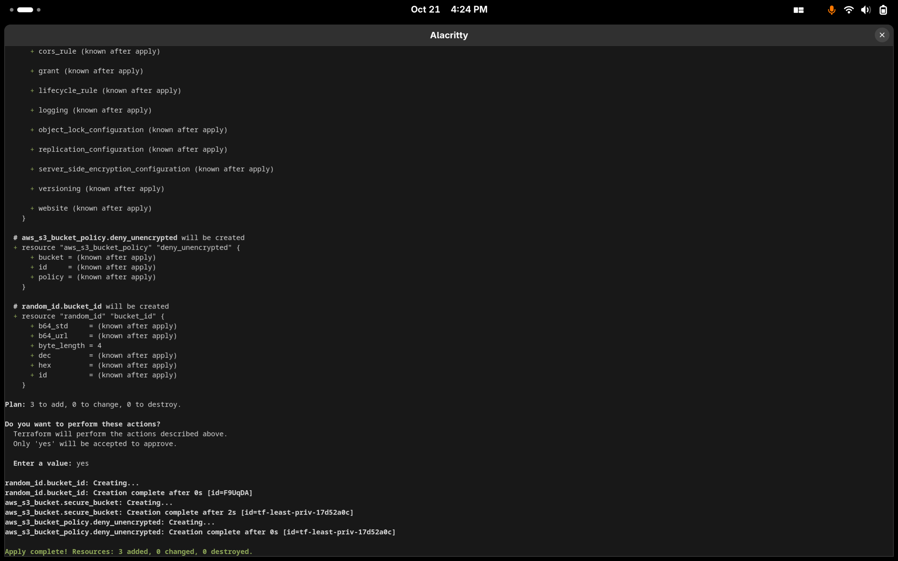
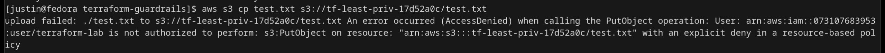
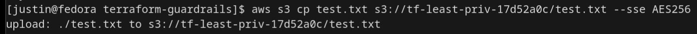

# Terraform Guardrail Lab - S3 Encryption Enforcement

My first Terraform security lab.  
Goal was to make an S3 bucket that blocks unencrypted uploads and only allows files that use `--sse AES256`.

## Lab Overview

Tools used:
- Terraform v1.13.4 (IaC)
- AWS CLI (for testing uploads)
- IAM user with least privilege (terraform-lab)
- Fedora Asahi Remix + Alacritty terminal

Main file: `main.tf`  
Reflection: [automation_lab_tue_reflection.md](./automation_lab_tue_reflection.md)

## What Terraform Built

- Random ID -> unique bucket name  
- S3 bucket -> `tf-least-priv-17d52a0c`  
- Bucket policy -> denies any upload unless it includes the header `"s3:x-amz-server-side-encryption": "AES256"`

Terraform output:

```
Apply complete! Resources: 3 added, 0 changed, 0 destroyed.
```

## Proof of Work

**Terraform Apply**
  
Terraform created 3 resources: random ID, S3 bucket, and deny-unencrypted policy.

**Access Denied (Unencrypted Upload)**
  
Upload blocked - unencrypted file rejected by the bucket guardrail.

**Encrypted Upload Success**
  
Upload passed - encryption header `--sse AES256` satisfied the policy.

## Reflection

See my full notes and explanation in  
[automation_lab_tue_reflection.md](./automation_lab_tue_reflection.md)

Covers what each command did, what I learned, and how I tested Terraform and AWS CLI together.

## Next Lab

Next: Python CloudTrail Parser  
Folder: `automation_lab_wed/`  
Goal: detect root logins and unauthorized API calls from CloudTrail logs using Python.  
This continues the theme of building cloud guardrails and monitoring end-to-end.
